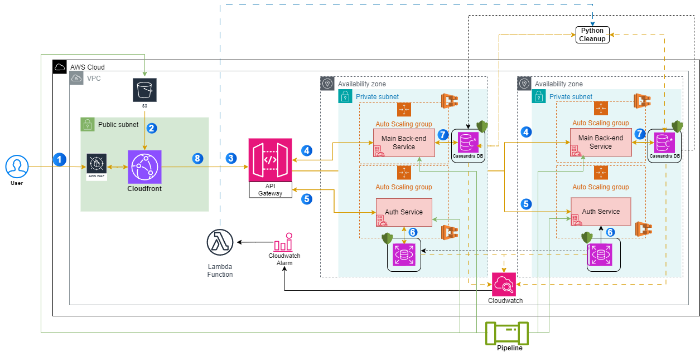

# Cloud Architecture Design

This README covers the architecture design for hosting a cloud-based solution that meets high-level requirements for security, scalability, and cost-effectiveness. The architecture revolves around deploying microservices and leveraging managed services for simplicity and maintainability.

Below is a breakdown of the solution, step-by-step, following the provided requirements with a few modifications based on cloud best practices.

---

## **Description of the App**

This app is a cloud-based service consisting of three key components:

1. **Auth Service** (Authentication/Authorisation): Ensures that every incoming request is verified before being passed along to the main application.
2. **Main Application** (NodeJS Service): Handles the core functionality, such as processing user requests and interacting with a backend database.
3. **Cleanup Job** (Python Script): Periodically or based on cloud-watch alerts archives old data, keeping the database optimised.

Each service is containerised, making it flexible and scalable via **AWS ECS**.

---

## **Architecture Diagram**

---

## **How It Works**

1. **User Access via CloudFront (Front-end Delivery)**
   - Users access the application via **CloudFront**, which serves the latest version of the front-end directly from **S3**. This ensures fast delivery of static assets, keeping the user interface updated.

2. **API Gateway for API Requests**
   - When users interact with the app (e.g., logging in or fetching data), API requests are sent to **API Gateway**. This serves as the entry point for all backend interactions.

3. **Auth Service for User Authentication**
   - If a user logs in, the credentials are passed from **API Gateway** to the **Auth Service**, which checks them against the **PostgreSQL** database to validate the user.

4. **PostgreSQL (Authentication Backend)**
   - The **Auth Service** queries **PostgreSQL** to verify user credentials. If the user is authenticated, the request continues. If not, access is denied.

5. **Main App (NodeJS) for Data Handling**
   - Once the user is authenticated, further requests (e.g., fetching or submitting data) are handled by the **Main App** (NodeJS), built from a **Dockerfile** and deployed on ECS. The Main App processes data, interacting with the **Cassandra** database as needed to store and retrieve information.

6. **Cassandra Database (Main Data Source)**
   - The **Main App** reads from and writes to a **Cassandra** database. This is where all the core app data is stored, ensuring it’s highly available and distributed.

7. **Python Cleanup Job (Database Hygiene)**
   - A periodic **Python Cleanup Job** runs on a schedule (using **CloudWatch Events**). This job sweeps both the **Cassandra** and **PostgreSQL** databases, archiving old or unnecessary data.

8. **Monitoring with CloudWatch**
   - The entire system is monitored using **CloudWatch** to ensure uptime, autoscaling, and handling of any potential issues.

---

## **Why Docker over JAR/TAR?**

- The requirements mentioned using **JAR** files for the **Auth Service** and **TAR** files for the **Main App**, but I went with **Docker** containers instead because **ECS** (Elastic Container Service) works like a charm for highly available and scalable deployments. Docker gives us better flexibility to manage dependencies and isolate services, all while keeping the deployment lightweight.

---

## **Considerations**

- **Security**: I’ve implemented **AWS WAF** to protect against malicious traffic before requests even reach the application. While security groups aren't explicitly represented in the diagram, in practice, they would be configured following the **principle of least privilege**. For example, **Auth Service** would only communicate with **PostgreSQL** on its specific port, and **Main App** would only talk to **Cassandra** on the necessary ports to ensure secure communication.
  
- **Scalability**: Auto-scaling for both the **Auth Service** and **Main App** ensures we can handle anything from a few users to a big rush. **API Gateway** manages and routes incoming traffic, distributing requests to the appropriate backend services.

- **Maintainability**: Using **Docker** and **ECS** makes it easy to roll out updates, scale services, and debug issues. Containerization ensures consistency across environments.

- **Cost Effectiveness**: I’ve deployed everything on **Auto Scaling Groups** and, where possible, leveraged **spot instances** to keep costs down while maintaining performance. Scaling policies ensure resources are only allocated when necessary.

---

## **What I'd Do With More Time**

- **Security Enhancements**: I'd implement **AWS Key Management Service (KMS)** for **encrypting data at rest** in both **Cassandra** and **PostgreSQL**, ensuring that all sensitive data remains secure. Additionally, I'd leverage **AWS Secrets Manager** to securely store and rotate database credentials and API keys.

- **Improved Scalability**: I would integrate **AWS Global Accelerator** to route traffic globally with improved availability and performance. This would reduce latency for users from different regions and provide automatic failover across AWS regions, ensuring high availability in case of region-level disruptions.

- **Enhanced Maintainability**: To streamline data retention and archiving, I'd leverage **Amazon S3 Glacier** to offload old data that’s archived by the **Python Cleanup Job**. This would allow long-term, cost-effective storage of older records from **PostgreSQL** and **Cassandra**, while keeping the operational databases lean and performant.

- **Cost Efficiency Improvements**: I’d explore **AWS Savings Plans** or **Reserved Instances** for long-running services to optimise costs while maintaining the necessary performance. This would offer better pricing for consistently running services without sacrificing the high availability and reliability that the app requires.

---
