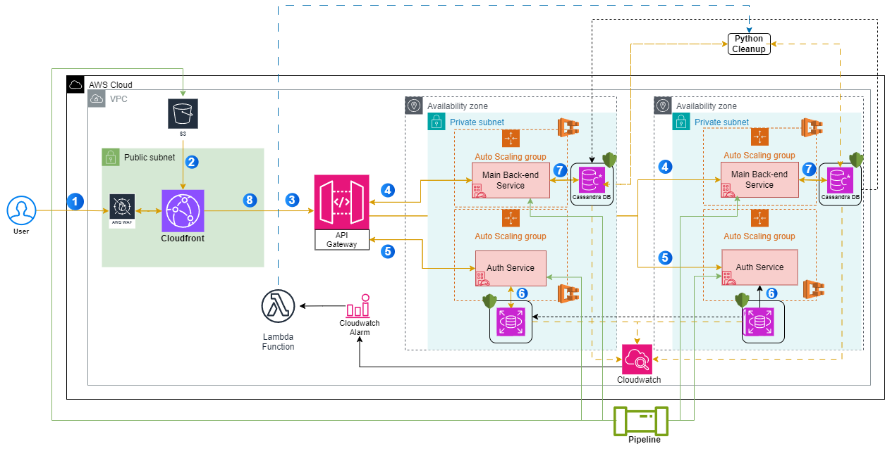

# Cloud Architecture Design

This README covers the architecture design for hosting a cloud-based solution that meets high-level requirements for security, scalability, and cost-effectiveness. The architecture revolves around deploying microservices and leveraging managed services for simplicity and maintainability.

Below is a breakdown of the solution, step-by-step, following the provided requirements with a few modifications based on cloud best practices.

## **Description of the App**

This app is a cloud-based service consisting of four key components:

1. **Front-End** The user-facing part of the app is hosted in S3, with CloudFront for delivery.
1. **Auth Service** (Authentication/Authorisation): Ensures that every incoming request is verified before being passed along to the main application.
2. **Main Application** (NodeJS Service): Handles the core functionality, such as processing user requests and interacting with a backend database.
3. **Cleanup Job** (Python Script): Periodically or based on cloud-watch alerts archives old data, keeping the database optimised.

## **Architecture Diagram**

## **Architecture Flow**

1. **User Access**: Users access the application through **CloudFront**.

2. **Front-end Delivery**: **CloudFront** pulls the latest version of the front-end from **S3**.

3. **API Requests**: API requests, such as logging in or fetching data, are sent through **API Gateway**.

4. **Main App Handling**: Once authenticated, the **Main App** (NodeJS) processes user requests, interacting with **Cassandra** for data.

5. **User Authentication**: **Auth Service** verifies login credentials against the **PostgreSQL** database via **API Gateway**.

6. **PostgreSQL Access**: The **Auth Service** interacts with **PostgreSQL** to validate the user credentials.

7. **Data Storage**: The **Cassandra** database stores all core application data, ensuring high availability and scalability.

8. **Response to User**: The processed data is sent back to the user via **CloudFront**.

9. **Monitoring**: The databases is monitored with **CloudWatch**, enabling logging and alerting for any issues.

10. **Cleanup**: The cleanup script is ran either via **Lambda Function** based on the **Cloudwatch** alarm.

## **Why Docker over JAR/TAR?**

- The requirements mentioned using **JAR** files for the **Auth Service** and **TAR** files for the **Main App**, but I opted for **Docker** containers instead. Using **ECS** with Docker allows for easier orchestration, scalability, and consistency across environments. Docker also simplifies dependency management and ensures a more flexible deployment pipeline, making it a better fit for the microservices architecture.

## **Considerations**

- **Security**: I’ve implemented **AWS WAF** to protect against malicious traffic before requests reach the application. While security groups aren't explicitly represented in the diagram, in practice, they would be configured following the **principle of least privilege**. For example, **Auth Service** would only communicate with **PostgreSQL** on its specific port, and **Main App** would only talk to **Cassandra** on the necessary ports to ensure secure communication.
  
- **Scalability**: Auto-scaling for both the **Auth Service** and **Main App**.  **API Gateway** manages and routes incoming traffic, distributing requests to the appropriate backend services.

- **Maintainability**: Using **Docker** and **ECS** makes it easy to roll out updates, scale services, and debug issues. Containerisation ensures consistency across environments.

- **Cost Effectiveness**: I’ve deployed everything using **Fargate** for the back-end and auth services.

## **What I'd Do With More Time**

- **Security Enhancements**: I'd implement **AWS Key Management Service (KMS)** for **encrypting data at rest** in both **Cassandra** and **PostgreSQL**, ensuring that all sensitive data remains secure. Additionally, I'd leverage **AWS Secrets Manager** to securely store and rotate database credentials and API keys.

- **Improved Scalability**: I would integrate **AWS Global Accelerator** to route traffic globally with improved availability and performance. This would reduce latency for users from different regions and provide automatic failover across AWS regions, ensuring high availability in case of region-level disruptions.

- **Enhanced Maintainability**: To streamline data retention and archiving, I'd leverage **Amazon S3 Glacier** to offload old data that’s archived by the **Python Cleanup Job**. This would allow long-term, cost-effective storage of older records from **PostgreSQL** and **Cassandra**, while keeping the operational databases lean and performant.

- **Cost Efficiency Improvements**: I’d explore **AWS Savings Plans** or **Reserved Instances** for long-running services to optimise costs while maintaining the necessary performance. This would offer better pricing for consistently running services without sacrificing the high availability and reliability that the app requires.

---
